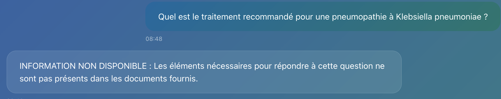

# RAG CHU - Application d'analyse de documents médicaux

Application RAG (Retrieval-Augmented Generation) spécialisée dans l'analyse et l'interrogation de documents médicaux officiels, utilisant l'intelligence artificielle pour extraire et structurer l'information clinique.

### Liens du projet : 

- **Code source GitHub** :
 [https://github.com/JTh34/rag-chu](https://github.com/JTh34/rag-chu)
- **Application en ligne** : 
[https://huggingface.co/spaces/JTh34/rag-chu](https://huggingface.co/spaces/JTh34/rag-chu)

# *Fonctionnement de l'Application*

### Architecture Générale

L'application fonctionne en 3 étapes principales :

1. **Analyse Visuelle** : Les documents PDF/images sont analysés par Claude d'Anthropic qui extrait le contenu médical structuré
2. **Vectorisation** : Le contenu est découpé en chunks sémantiques et transformé en embeddings via OpenAI
3. **Interrogation RAG** : Les questions utilisateur sont confrontées aux chunks les plus pertinents pour générer des réponses précises

### Pipeline de Traitement

```
Document PDF/Image 
     ↓
[Claude Vision] → Extraction du contenu médical structuré
     ↓
[Chunking] → Découpage en sections sémantiques
     ↓
[OpenAI Embeddings] → Vectorisation des chunks
     ↓
[Qdrant Vector DB] → Stockage des vecteurs
     ↓
[Question utilisateur] → Recherche de similarité
     ↓
[RAG Chain] → Génération de réponse contextualisée
```

# *Solutions techniques utilisées*

### Backend (Python/FastAPI)
- **FastAPI** : API REST avec documentation automatique
- **LangChain** : Framework pour la construction de chaînes RAG
- **Qdrant** : Base de données vectorielle en mémoire
- **Anthropic Claude** : Modèle vision pour l'analyse de documents (claude-3-sonnet-20240229)
- **OpenAI** : Embeddings (text-embedding-3-small) et LLM (gpt-4o-mini)
- **PyMuPDF/Pillow** : Traitement des documents PDF et images

### Frontend (React)
- **React 18** : Interface utilisateur moderne
- **WebSocket** : Communication temps réel pour le suivi de progression
- **React-Dropzone** : Upload de fichiers avec drag & drop
- **Axios** : Client HTTP pour les appels API

### Infrastructure
- **Docker** : Conteneurisation pour le déploiement
- **uv** : Gestionnaire de dépendances Python moderne
- **Hugging Face Spaces** : Plateforme de déploiement

# *Prompt RAG utilisé*

Le système utilise un prompt spécialisé pour garantir la précision médicale :

```python
medical_prompt_template = """Tu es un assistant médical expert analysant des recommandations cliniques officielles.

CONTEXTE MÉDICAL :
{context}

QUESTION : {question}

INSTRUCTIONS :
1. Si l'information nécessaire N'EST PAS dans le contexte, réponds exactement : "INFORMATION NON DISPONIBLE : Les éléments nécessaires pour répondre à cette question ne sont pas présents dans les documents fournis."

2. Si l'information EST présente, structure ta réponse ainsi :

RÉPONSE :
Donne une réponse directe et précise.

DÉTAILS CLINIQUES :
- Posologie/Critères : cite les valeurs exactes du document
- Situation clinique : précise le contexte d'application  
- Source : indique le tableau ou la section du document

PRÉCAUTIONS :
Mentionne les contre-indications ou limitations du contexte, ou indique "Aucune précaution spécifique mentionnée".

RÈGLES ABSOLUES :
- Cite uniquement les informations présentes dans le contexte
- Pour les posologies : valeurs exactes, pas d'approximation
- Ne jamais inventer ou extrapoler
- Distingue clairement les différentes situations cliniques (avec/sans comorbidité, grave/non grave)

RÉPONSE :"""
```

Ce prompt garantit que l'assistant :
- Ne répond que sur la base du contexte fourni
- Structure ses réponses de manière médicale
- Indique clairement quand l'information n'est pas disponible
- Cite les valeurs exactes (posologies, critères cliniques)


# *Copies d'écran de l'application*


# *Questions et Réponses*
### *Document: "Prise en charge des Pneumopathies aigues communautaires V2.docx"*

## Questions AVEC réponse dans le document 

#### 1. Critères de stabilité clinique
**Question :** Quels sont les 5 critères de stabilité clinique précis qu'un patient doit présenter pour considérer l'arrêt du traitement ?

**Réponse attendue :** Apyrexie (≤ 37,8°C), stabilité tensionnelle (≥ 90 mmHg), Pouls ≤ 100/min, FR ≤ 24/min, Saturation ≥ 90% en air ambiant (ou PaO2 ≥ 60 mmHg)

**Réponse obtenue :** 


#### 2. Durée de traitement adaptée
**Question :** Si un patient atteint tous les critères de stabilité à J3, quelle est la durée de traitement recommandée ?

**Réponse attendue :** 3 jours

**Réponse obtenue :** 


#### 3. Antibiotique de choix - PAC sans comorbidité
**Question :** Quel est l'antibiotique de première ligne recommandé pour une PAC non grave hospitalisée sans comorbidité ?

**Réponse attendue :** Amoxicilline 1-2g/8h PO (ou IV)

**Réponse obtenue :** 


#### 5. Alternative aux C3G
**Question :** Quelle est l'alternative aux C3G injectables mentionnée pour les PAC sans comorbidité, et à quelle condition ?

**Réponse attendue :** Levofloxacine 500mg/J, réservée aux situations d'allergie grave aux bétalactamines et pas d'autres possibilités thérapeutiques

**Réponse obtenue :** 


## Questions SANS réponse dans le document 

#### 1. Pédiatrie (PIÈGE)
**Question :** Quelle est la posologie d'amoxicilline recommandée chez l'enfant de 5 ans pour une pneumopathie aiguë communautaire ?

**Réponse attendue :** "Je ne trouve pas cette information dans le document. Le document précise qu'il traite uniquement des PAC chez l'adulte hospitalisé."

**Réponse obtenue :** 


#### 2. Pathogène spécifique non mentionné (PIÈGE)
**Question :** Quel est le traitement recommandé pour une pneumopathie à Klebsiella pneumoniae ?

**Réponse attendue :** "Le document ne fournit pas de recommandations spécifiques pour Klebsiella pneumoniae. Il traite principalement des pneumopathies supposées d'origine bactérienne de manière générale."

**Réponse obtenue :** 


# *Fonctionnalités*

- **Upload de documents** : PDF et images médicales
- **Analyse visuelle intelligente** : Extraction automatique du contenu structuré
- **Recherche sémantique** : Vectorisation et similarité cosinus
- **Chat médical** : Interface conversationnelle spécialisée
- **Suivi temps réel** : WebSocket pour progression du traitement
- **API REST documentée** : Endpoints FastAPI


# *Structure du projet/

```
RAG_CHU-app/
├── requirements.txt       # Dépendances Python globales
├── pyproject.toml         # Configuration workspace
├── backend/               # API FastAPI
│   ├── src/               # Code source Python
│   ├── pyproject.toml     # Dépendances backend
├── frontend/              # Interface React
│   ├── src/               # Code source React
│   ├── public/            # Assets publics
│   └── package.json       # Dépendances frontend
└── uploads/               # Fichiers temporaires
```